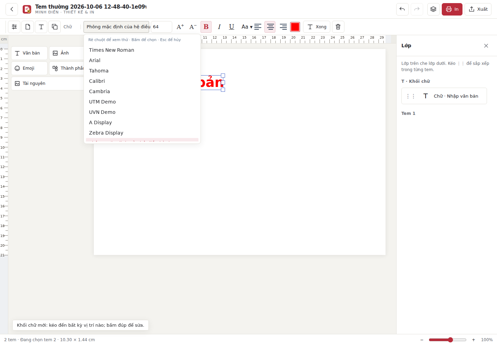

# Ưu tiên phông thường dùng trong bộ chọn

Chỉ thay thứ tự phông trong danh sách chọn phông chính và từng dòng; giữ vị trí thanh công cụ/trang chính. Các phông có trên máy được ưu tiên: Times New Roman, Arial, Tahoma, Calibri, Cambria, Verdana, Georgia, Helvetica, Helvetica Neue. Sau đó giữ nhóm UTM, UVN và các phông khác theo tên. Không tự tải hay thêm phông chưa có vào danh sách; phông đang dùng nhưng chưa tìm thấy vẫn giữ nhãn cảnh báo hiện có.

PASS tests/art-ui-smoke.cjs với Chromium thực: danh sách họ phông fixture đảo thứ tự, mở bộ chọn thật, kiểm tra năm phông đầu và phông khác vẫn còn, chọn Times New Roman, giữ nguyên văn bản; toàn bộ kiểm thử art shell, canvas, focus, thiết kế gần đây, reduced motion và cửa sổ hẹp vẫn qua. Fixture kiểm tra thứ tự/handler, không chứng minh mọi phông này được cài trên máy Linux. Không build native Mac/Windows trong lần sửa này.

