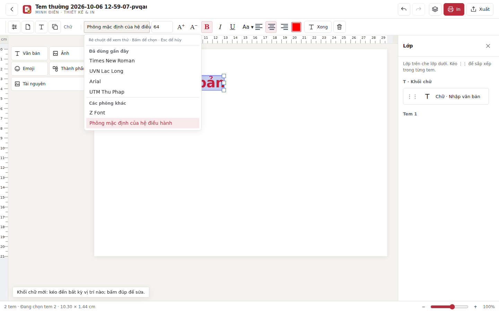

# Phông đã dùng gần đây và tự nạp phông

Danh sách chọn phông chính và từng dòng có nhóm Đã dùng gần đây. Ghi nhận khi người dùng bấm chọn hoặc chọn bằng bàn phím; rê chuột/xem thử, tải mẫu và mở file không thay đổi lịch sử. Giữ tối đa 12 họ phông, phông vừa chọn lên đầu và không lặp. Các phông khác giữ cách sắp UTM, UVN, sau đó theo tên; đã bỏ việc ưu tiên cố định Times/Arial. Lịch sử dùng localStorage riêng theo origin, giữ qua đóng/mở lại trên cùng địa chỉ; bắt đầu ghi nhận từ bản này. Phông từng dùng nhưng chưa thấy trên máy giữ nhãn cảnh báo. Phông đang dùng và văn bản không bị thay đổi vì sắp danh sách.

Nút Lấy phông trên máy đã gỡ khỏi DOM. Khi load, ứng dụng thử queryLocalFonts; nếu cần user activation, tự gọi trong lần click/phím đầu tiên, không cần nút riêng và không chặn thao tác chỉnh sửa. Thành công không hỏi lại trong phiên. Từ chối quyền không lặp yêu cầu mỗi lần click; vẫn có phông hệ thống và thông tin quyền trong bộ chọn/panel phông. Quyền bị từ chối có thể cấp lại trong cài đặt trang rồi mở lại trang. Trình duyệt không có API, dữ liệu lịch sử hỏng và localStorage bị chặn đều có fallback.

Ràng buộc trình duyệt: Local Font Access yêu cầu transient activation; trang không thể ép hộp hỏi quyền xuất hiện khi chưa có thao tác. [Đặc tả API](https://wicg.github.io/local-font-access/#font-manager).

PASS tests/recent-fonts-smoke.cjs: thứ tự chọn thực tế, khử trùng, hover không ghi nhận, bàn phím/chọn phông từng dòng, đóng/mở lại profile, tự scan khi thao tác, không gọi lặp, từ chối/không hỗ trợ/lịch sử JSON hỏng. Test còn cấp quyền qua CDP và dùng queryLocalFonts thật của Chromium để đọc phông được cài trên Linux; kiểm tra fontRecords và machineFonts được nạp. Fixture họ phông dùng kiểm tra MRU, không chứng minh UTM/UVN được cài trên máy Linux.

PASS art-ui-smoke.cjs và properties-scroll-smoke.cjs: công cụ, ảnh, dữ liệu/canvas, focus/scroll, bốn kích thước cửa sổ và PDF nền mây thực. Không có pageerror trong luồng MRU. desktop/smoke.cjs cập nhật cho nút đã gỡ và trường hợp chờ thao tác; chưa chạy native Electron hoặc build Mac/Windows trong lần sửa này.

