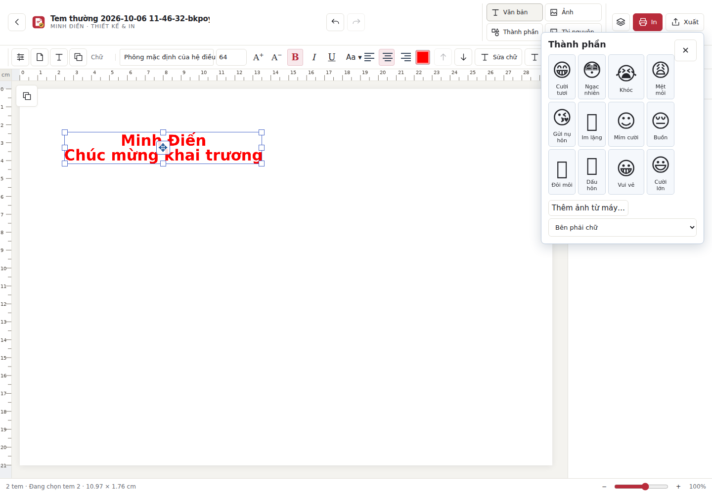
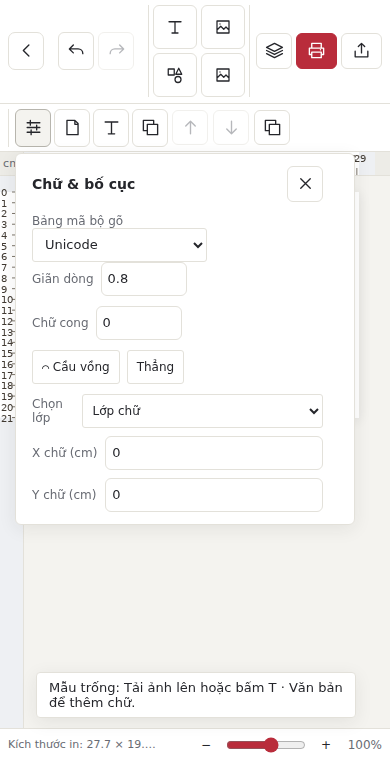

# Công cụ phía trên; bảng bên phải chỉ có Lớp

Đã thay bảng Thuộc tính bên phải bằng nhóm icon trên thanh công cụ. Các điều khiển gốc được chuyển nguyên node để giữ listener, giá trị và định dạng: Chữ & bố cục, Viền tem mây, Trang & kích cỡ, Công cụ trên máy và Nội dung mẫu. Viền mây chỉ xuất hiện cho Tem mây. Thanh ảnh và chữ hiện có vẫn hoạt động. Không thay đổi schema dữ liệu hoặc nội dung tem.

Mỗi icon có tooltip và aria-label tiếng Việt; mở một nhóm công cụ sát nút. Bảng có chiều cao giới hạn theo cửa sổ và cuộn riêng. Escape, nút đóng, click ngoài; trả focus khi đóng bằng bàn phím; phím mũi tên/Home/End đổi focus giữa icon. Escape trong hộp thoại màu ưu tiên đóng hộp thoại màu. Giảm chuyển động theo thiết lập hệ thống.

Bảng bên phải chỉ có Lớp, kéo sắp xếp và cuộn độc lập. Mở công cụ phía trên không đổi trạng thái bảng Lớp hoặc kích thước canvas. Bỏ nút khổ thiết kế trùng lặp, dùng icon Trang & kích cỡ.

## Kiểm chứng

Chromium thật qua launcher Python. PASS tests/properties-scroll-smoke.cjs ở 1440×900, 900×500, 390×760, 390×420: mọi nhóm trong viewport, cuộn tới điều khiển cuối, sửa giãn dòng và mở lại đúng giá trị, hộp màu, Escape/focus, click ngoài, một nhóm mỗi lần, dữ liệu giữ nguyên khi chỉ mở/đóng và bảng Lớp cuộn được. Không có lỗi JavaScript hoặc tải tài nguyên.

PASS hồi quy: art-ui-smoke, clipboard-smoke, editor-interactions-smoke, image-tools-smoke, autosave-smoke. Kiểm tra ảnh gồm pipeline PNG/PDF thực tế; tách nền chỉ kiểm tra hợp đồng backend bằng fixture, không chạy model AI. Chưa chạy native Mac hoặc build Mac/Windows.

## Khôi phục màu nền mây

Trong icon đám mây, thêm lại Màu nền mây. Dùng bộ chọn màu hiện có: màu đơn, gradient và trong suốt. Khôi phục mặt nạ nền mây trong render raster và SVG, đồng thời bỏ việc ép nền về trong suốt khi mở mẫu/undo. Chỉ áp dụng nền cho Tem mây; Tem thường và chữ tự do vẫn trong suốt. Mẫu thiếu thuộc tính nền giữ mặc định trong suốt an toàn.

PASS kiểm tra thực tế qua nút chọn màu và mã #22bb66: pixel màu nền trên canvas, PNG giải mã thực tế, SVG, PDF tải xuống và raster hóa bằng PyMuPDF; undo/redo và serialize/restore thiết kế giữ đúng màu. PASS autosave-smoke.
