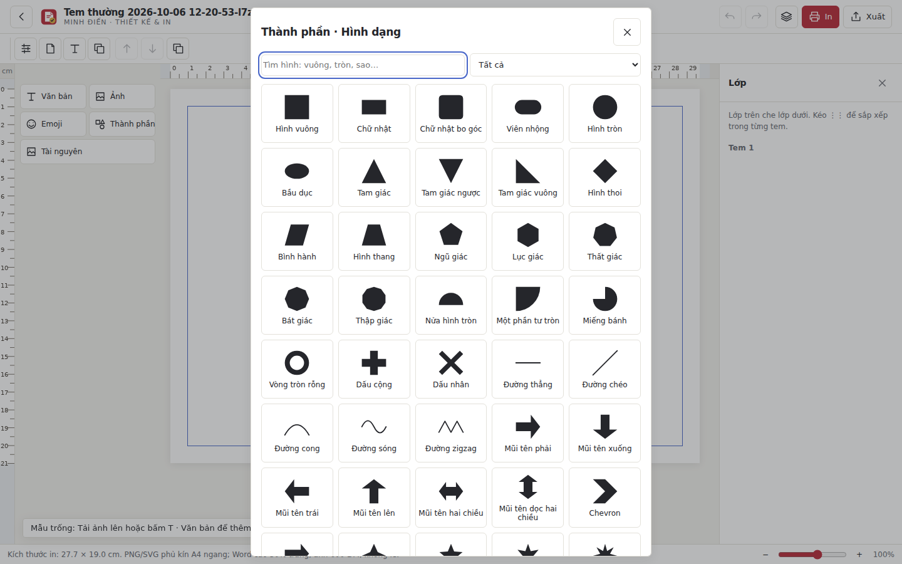
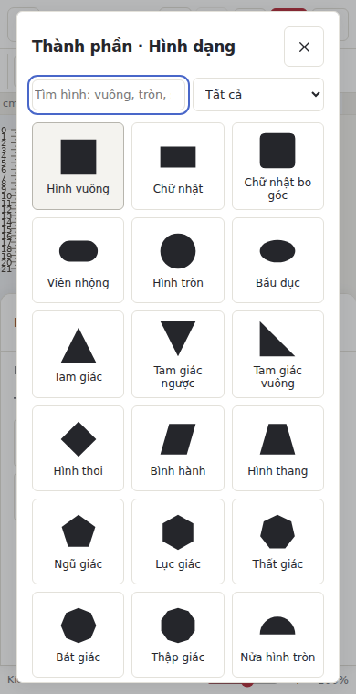

# Emoji và Thành phần — 57 hình vector offline

Emoji được giữ trong bộ chọn riêng. Thành phần mở bộ hình dạng mới; có tìm kiếm tiếng Việt có dấu/không dấu và lọc nhóm. Hình dùng dữ liệu đường vector do ứng dụng tạo, không tải ảnh từ mạng.

## Hình học (23)

Hình vuông, Chữ nhật, Chữ nhật bo góc, Viên nhộng, Hình tròn, Bầu dục, Tam giác, Tam giác ngược, Tam giác vuông, Hình thoi, Bình hành, Hình thang, Ngũ giác, Lục giác, Thất giác, Bát giác, Thập giác, Nửa hình tròn, Một phần tư tròn, Miếng bánh, Vòng tròn rỗng, Dấu cộng, Dấu nhân.

## Mũi tên & đường (13)

Đường thẳng, Đường chéo, Đường cong, Đường sóng, Đường zigzag, Mũi tên phải, Mũi tên xuống, Mũi tên trái, Mũi tên lên, Mũi tên hai chiều, Mũi tên dọc hai chiều, Chevron, Mũi tên gấp khúc.

## Sao & huy hiệu (10)

Ngôi sao 4 cánh, Ngôi sao 5 cánh, Ngôi sao 6 cánh, Ngôi sao 8 cánh, Ngôi sao 10 cánh, Ngôi sao 12 cánh, Tia nắng 24 cánh, Huy hiệu 16 cánh, Khiên, Dải ruy băng.

## Trang trí & khung (11)

Trái tim, Trăng khuyết, Giọt nước, Chiếc lá, Đám mây, Bong bóng thoại, Thoại bầu dục, Vé, Ngoặc vuông, Khung chữ nhật, Hoa sáu cánh.

## Thao tác

Chèn hình rồi kéo, đổi kích thước hoặc xoay bằng các tay nắm hiện có. Thanh hình dạng hỗ trợ màu tô, bật/tắt tô, màu viền, độ dày và nét liền/đứt/chấm, độ mờ. Hình khóa không được sửa. Các hình dùng cấu trúc đối tượng hiện có, hỗ trợ nhóm/bỏ nhóm, nhân bản, hoàn tác, tự lưu và mở lại. Emoji cũ và dữ liệu ảnh được giữ nguyên.

Giữ giới hạn hiện có: tối đa 12 hình/ảnh trong mỗi tem. Danh mục là 57 hình phổ biến, không phải mọi hình có trên Internet. PDF hiện dùng ảnh raster theo pipeline xuất hiện có; SVG giữ đường hình vector. Chưa build hoặc chạy ứng dụng native trên Mac/Windows trong môi trường Linux này.

## Tài liệu tham khảo phân loại

- [Figma Shape tools](https://help.figma.com/hc/en-us/articles/360040450133-Shape-tools)
- [Figma ShapeWithTextNode](https://developers.figma.com/docs/plugins/api/ShapeWithTextNode/)

## Kiểm thử

Xem `tests/shapes-smoke.cjs`: dựng và đếm pixel của cả 57 đường hình, Emoji tách riêng, tìm kiếm không dấu, Escape và trả focus, chèn/undo/redo, màu/viền/độ mờ, kéo, nhóm/bỏ nhóm/nhân bản, khóa, PNG/PDF qua Pillow và PyMuPDF, SVG, tự lưu/đóng/mở lại và cửa sổ 390 px; kiểm tra lỗi trang và tài nguyên HTTP. Kiểm thử hồi quy: `art-ui-smoke.cjs`, `clipboard-smoke.cjs`, `autosave-smoke.cjs`. Launcher Python thật được dùng cho kiểm thử hình; whitelist PowerShell và extraResources Electron đã thêm module.

Kết quả: PASS các bài kiểm thử nêu trên, `studio-core.cjs`, `delete-template-smoke.cjs`, kiểm tra cú pháp JS/Python và ánh xạ tài nguyên Electron. Không có lỗi pageerror hoặc tài nguyên HTTP trong luồng hình.

## Sửa bộ chọn màu

Cập nhật trực tiếp bằng sự kiện input của bộ chọn màu, không chờ đóng hộp chọn. Chọn màu tô bật lại tô nền; chọn màu viền khi viền bằng 0 bật viền 2 px. Giữ độ dày viền đã đặt. Hàng đợi xác định đối tượng bằng id, bảo vệ khóa và vùng chọn; tránh đồng bộ giá trị cũ vào bộ chọn màu đang có focus. Kiểm thử bổ sung chuỗi input màu nhanh, pixel tô và viền, undo/redo, lưu/mở lại và màu trong PNG thực tế.
